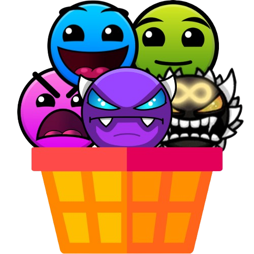
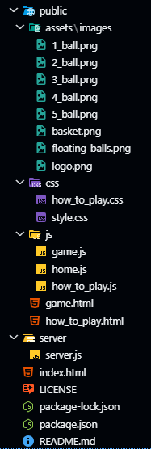

# 🎮 Catch the Ball

A modern, engaging browser-based arcade game where players test their reflexes and strategic thinking by catching falling balls of different types and values.



## 🌟 Features

- **Dynamic Gameplay**
  - Multiple ball types with varying speeds and point values
  - Progressive difficulty scaling
  - Real-time score tracking and high score system
  - Smooth animations and visual effects

- **Responsive Controls**
  - Keyboard arrow keys for precise movement
  - Touch screen support for mobile play
  - Space bar to pause/resume
  - R key for quick restart

- **Visual Polish**
  - Smooth animations and transitions
  - Real-time visual feedback
  - Particle effects and ball glow
  - Responsive design for all screen sizes

- **Performance**
  - GPU-accelerated animations
  - Optimized canvas rendering
  - Efficient collision detection
  - Smooth 60 FPS gameplay

## 🎯 How to Play

1. **Basic Controls**
   - ← → Arrow keys to move the basket
   - Space to pause/resume
   - R to restart game

2. **Ball Types**
   | Ball | Speed | Points | Difficulty |
   |------|--------|---------|------------|
   | Basic | Slow | 1 | Very Easy |
   | Swift | Medium | 3 | Easy |
   | Speed | Fast | 5 | Medium |
   | Power | Very Fast | 7 | Hard |
   | Master | Maximum | 10 | Extreme |

3. **Scoring**
   - Catch balls to earn points
   - Different balls have different point values
   - Chain catches for bonus points
   - Beat your high score!

## 🚀 Getting Started

### Prerequisites
- Node.js (v14 or higher)
- Modern web browser with canvas support

### Installation

1. Clone the repository:
   ```bash
   git clone https://github.com/Prath-Digital/catch_the_ball.git
   cd catch_the_ball
   ```

2. Install dependencies:
   ```bash
   npm install
   ```

3. Start the server:
   ```bash
   node server/server.js
   ```

4. Open your browser and navigate to:
   ```
   http://localhost:3000
   ```

## 🛠️ Technology Stack

- **Frontend**
  - HTML5 Canvas
  - Vanilla JavaScript (ES6+)
  - CSS3 with modern features
  - Web Animations API

- **Backend**
  - Node.js
  - Express.js

- **Assets**
  - Custom sprite animations
  - Optimized image assets
  - Responsive design

## 🎨 Game Design

### Visual Style
- Modern, minimalist interface
- Smooth animations and transitions
- Particle effects and visual feedback
- Responsive layout for all devices

### Performance Optimizations
- GPU-accelerated animations
- Efficient canvas rendering
- Optimized asset loading
- Smooth gameplay at 60 FPS

## 🔧 Development

### Project Structure


### Build and Run

Development mode:
```bash
npm run dev
```

Production mode:
```bash
npm start
```

## 📜 License

This project is licensed under the MIT License - see the [LICENSE](LICENSE) file for details.

## 🙏 Acknowledgments

- Ball sprites and visual assets
- Game design inspiration
- Community feedback and support

## 📞 Support

For support, please open an issue in the repository or contact the maintainers.

---
Made with ❤️ by Prath Digital (Prath Udhnawala)